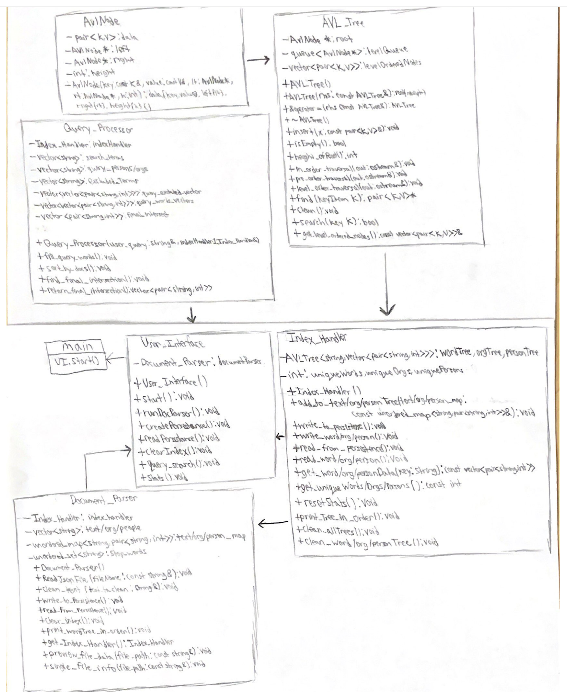
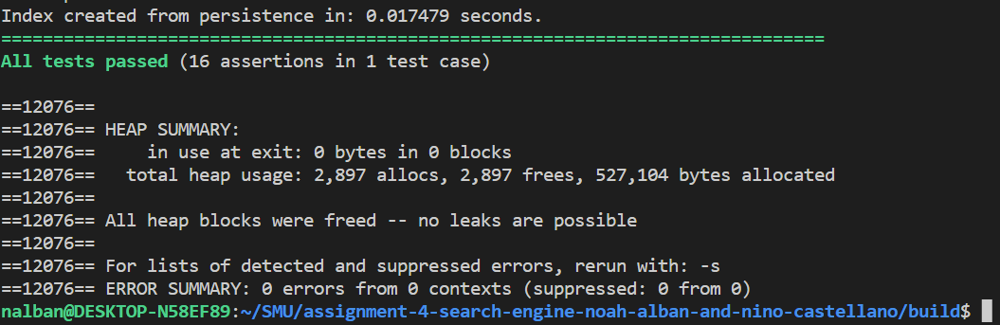

# Assignment 4: Search Engine Nino and Noah
## High-level Design of Solution

- UML class diagram:

## Your Timeline to Finish the Project
Weekly milestones/tasks. Set out a plan at the beginning and then record when you got it done.

| Task            | Planned completion | Actual completion | Time spent in hrs by Nino | Time spent in hrs by Noah |
|-----------------|:------------------:|:-----------------:|:-------------------------:|:-------------------------:|
| AVLTree         |      April 10      |     April 10      |             5             |            40             |
| AVLTree Tests   |      April 10      |     April 10      |             0             |            12             |
| Document Parser |      April 18      |     April 18      |            61             |             2             |
| Index Handler   |      April 21      |     April 25      |            20             |            24             |
| Query Processor |      April 21      |     April 21      |            83             |             3             |
| User Interface  |      April 26      |     April 25      |            41             |            20             |
| Hash-Map        |      April 21      |  Not Implemented  |             2             |             1             |
| Hash-Map Tests  |      April 21      |  Not Implemented  |             3             |             0             |
| Documentation (Including UML)  |      April 27      |  May 1  |             6             |             7             |

## Used Data Structures
Explanation of what data structures are used where. For each, state
 time and space complexity (Big-Oh),
#### Why it is the appropriate data structure and what other data structure could have been used.

- **AVL Tree O(logN)**: Insert, delete, search, and traversal are all worst case O(logN) time complexity. Space complexity of the AVL tree is O(n). We could have used a linked list for our index instead of an AVLTree, but the linked list has a time complexity of O(n) to search which means that it is much slower than our AVL Tree implementation.
- **Unordered Map O(1), worst case O(n)**: Used for keeping track of the words, orgs, and people found for each file read and added to the tree then cleared after every file. We do this for fast insertion and retrieval and checking. 
- **Unordered Set O(1), worst case O(n)**: Used for storage of stopwords so that it can be used for quick access and retrieval from set when checking for stopwords in parsing steps
- **Vector: Insertion is O(1)**, so good for keeping all the words in one file in place and then adding to tree by first checking if exists then removing stopwords and stemming tokens. No Retrieval at specific index being done so no need to worry about O(n) case. An alternative to vectors are arrays, but these don't have access to as many helper functions by default.
- **Pair: O(1)** accessing values of pairs is constant we use a pair for holding each files (path,specific word/org/person frequency). We could have created new data types and implemented classes for them, but pair is in standard template library and allows us to do the same thing.
- **Queue: O(1)** Time complexity of push and pop is O(1). Space complexity is O(n). It is appropriate to use this data structure in the level-order-traversal implementation in the AVLTree, because it uses FIFO to visit each node on a tree level before visiting the children of the nodes on this level. A link list could have been used, but standard template library's queue allows use to easily push to the back and pop the front. 

## User Documentation
How to use the software.
Users have 7 options: 
1. Run Doc Parser on File System
   - this asks the user to enter the file path for the file system e.g "../sample_data"
   - upon completion, the process runtime will be displayed

2. Create Persistence File
   - this automatically writes to persistence file in level order using existing trees or index 

3. Read From Existing Persistence File
   - this reads from existing persistence file and populates index without having to use the doc parser,.Because the persistence file is in level order, the insertions are fast because there will be no need for rotations.
   - upon completion, the process runtime will be displayed

4. Clear Index(Clear All Trees)
   - this makes all existing trees in the index empty

5. Search a Query
   - here the user enters a query e.g "german government ORG:reuters PERSON:Eric -profit" and query returns all the documents that have all these terms excluding documents with anything followed by the "-"
   - user is then allowed to open up one of the documents of choice with all the text or can just continue with the program 
   - Example output with this query "german government ORG:reuters PERSON:Eric -profit"
      1. German firms doing business in UK gloomy about Brexit - survey
          https://www.reuters.com/article/uk-britain-eu-germany/german-firms-doing-business-in-uk-gloomy-about-brexit-survey-idUSK
          CN1GB1GJ
          Publisher: Reuters Editorial
          Date Published: 2018-02-27T20:09:00.000+02:00
   
   - Example output with this query "reuters"
      1. German firms doing business in UK gloomy about Brexit - survey
          https://www.reuters.com/article/uk-britain-eu-germany/german-firms-doing-business-in-uk-gloomy-about-brexit-survey-idUSK
          CN1GB1GJ
          Publisher: Reuters Editorial
          Date Published: 2018-02-27T20:09:00.000+02:00

      2. BRIEF-FrancescaΓÇÖs Sees Q4 2017 GAAP Earnings Per Share $0.07 To $0.11
         https://www.reuters.com/article/brief-francescas-sees-q4-2017-gaap-earni/brief-francescas-sees-q4-2017-gaap-earnings-per
         -share-0-07-to-0-11-idUSASB0C7UA
         Publisher: Reuters Editorial
         Date Published: 2018-02-28T05:29:00.000+02:00

      3. BRIEF-Kewaunee Scientific Q3 Earnings Per Share $0.31
         https://www.reuters.com/article/brief-kewaunee-scientific-q3-earnings-pe/brief-kewaunee-scientific-q3-earnings-per-share
         -0-31-idUSASB0C7X1
         Publisher: Reuters Editorial
         Date Published: 2018-02-28T08:59:00.000+02:00

      4. BRIEF-Strax Ab Result For Period Jan 1 - Dec 31 2017 amounted to 0.03 Euros Per ShareΓÇï
         https://www.reuters.com/article/brief-strax-ab-result-for-period-jan-1-d/brief-strax-ab-result-for-period-jan-1-dec-31-2
         017-amounted-to-0-03-euros-per-share-idUSFWN1QH1E2
         Publisher: Reuters Editorial
         Date Published: 2018-02-28T04:00:00.000+02:00
     
    - Example output with this query "reuters results"
      1. BRIEF-Kewaunee Scientific Q3 Earnings Per Share $0.31
         https://www.reuters.com/article/brief-kewaunee-scientific-q3-earnings-pe/brief-kewaunee-scientific-q3-earnings-per-share
         -0-31-idUSASB0C7X1
         Publisher: Reuters Editorial
         Date Published: 2018-02-28T08:59:00.000+02:00

      2. BRIEF-Strax Ab Result For Period Jan 1 - Dec 31 2017 amounted to 0.03 Euros Per ShareΓÇï
         https://www.reuters.com/article/brief-strax-ab-result-for-period-jan-1-d/brief-strax-ab-result-for-period-jan-1-dec-31-2
         017-amounted-to-0-03-euros-per-share-idUSFWN1QH1E2
         Publisher: Reuters Editorial
         Date Published: 2018-02-28T04:00:00.000+02:00

   Output of search query also displays the number of matches found (up to 15), and the time it took to find the results.
     
6. Show Statistics
   - This shows interesting statistics such number of unique words, orgs, and persons in trees.
   + (statistics regarding runtime are displayed upon completion of the following processes: 1. parse documents, 3. read from persitence, 5. search query.) 

7. Exit Program 
   - This finishes the program and exits.

## Performance
- Statistics for indexing all documents and timing.
- Parsed through 2,000 documents in 2.64 seconds
- Parsed through 5,000 documents in 35.06 seconds
- Parsed through 10,000 documents in 61.58 seconds
- Parsed through 25,000 documents in 147.97 seconds or 2 minutes 
- Parsed though 57,802 documents in about 13 minutes

## Automatic Tests and Memory Tests
You need to describe test cases for:
- Tests for your AVL tree's function: Run testAVL executable to see tests for the functions of the AVL Tree.
- Tests for your AVL tree for memory leaks (don't forget to test the persistence functions) - The image is an output from valgrind after running our testAVL executable.

- Tests for indexer: Included in testAVL executable.

## Bonus Work (max. of 10)
### We attempted the following bonus points.
- "Very Smart" ranking for query results using set intersection and set difference.
- Hashmap for faster query times. (attempted but not functional)